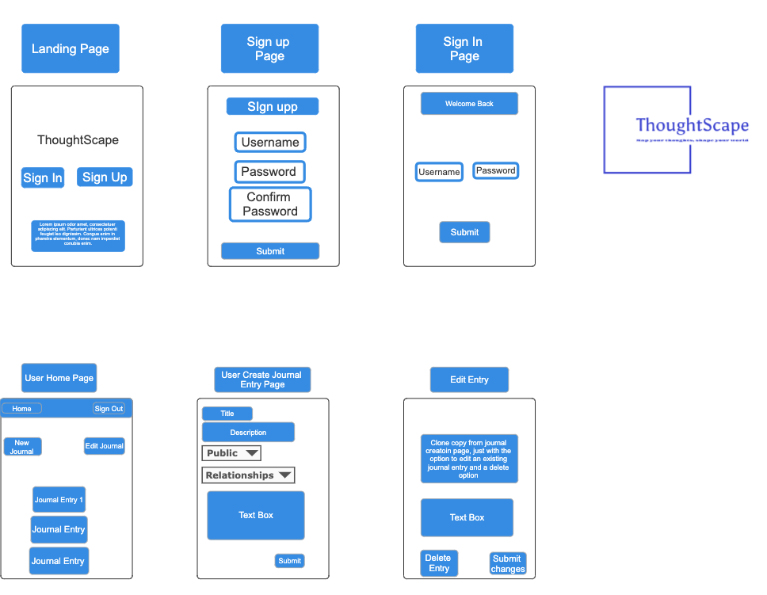
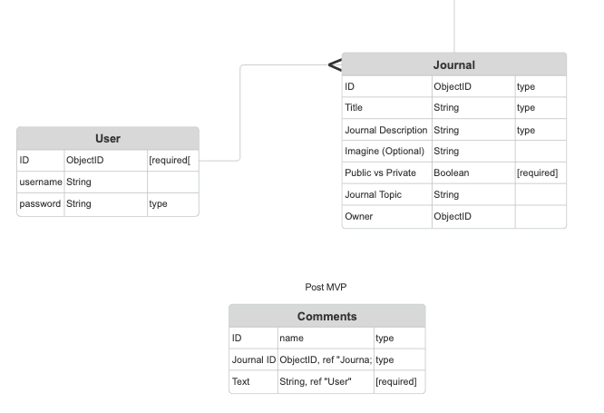

# Thoughtscape

Thoughtscape is an innovative online journaling platform designed to help individuals explore, map, and reflect on their personal thoughts and experiences. By providing a tranquil, creative space, Thoughtscape encourages users to document their emotions, ideas, and moments of self-discovery. Whether through private journaling or sharing with a supportive community, Thoughtscape empowers people to chart their personal growth in a meaningful way.

## Features

- **Create and Edit Posts**: Users can easily create journal entries, edit existing posts, and reflect on their thoughts.
- **Privacy Settings**: Journal entries can be set as public or private, allowing users to control the visibility of their content.
- **Genre Filtering**: Posts can be categorized by genre, such as Personal, Work, Travel, and more, making it easy to filter and explore specific topics.
- **User Authentication**: Secure sign-up and login functionality to ensure that only authorized users can access and modify their journals.
- **Shooting Star Background**: The platform features a visually appealing animated background with shooting stars to create a calming and immersive experience.
- **Responsive Design**: The layout is designed to work seamlessly across different devices, from desktops to mobile phones.

The "meat and potatoes" of this CRUD app is the logic behind the signing in and signing up process. here is the code below showing how that works 

```javascript
router.get('/sign-up', (req, res) => {
  res.render('auth/sign-up.ejs');
});

router.get('/sign-in', (req, res) => {
  res.render('auth/sign-in.ejs');
});

router.get('/sign-out', (req, res) => {
  req.session.destroy();
  res.redirect('/');
});

router.post('/sign-up', async (req, res) => {
  try {
    // Check if the username is already taken
    const userInDatabase = await User.findOne({ username: req.body.username });
    if (userInDatabase) {
      return res.send('Username already taken.');
    }
  
    // Username is not taken already!
    // Check if the password and confirm password match
    if (req.body.password !== req.body.confirmPassword) {
      return res.send('Password and Confirm Password must match');
    }
  
    // Must hash the password before sending to the database
    const hashedPassword = bcrypt.hashSync(req.body.password, 10);
    req.body.password = hashedPassword;
  
    // All ready to create the new user!
    await User.create(req.body);
  
    res.redirect('/auth/sign-in');
  } catch (error) {
    console.log(error);
    res.redirect('/');
  }
});

router.post('/sign-in', async (req, res) => {
  try {
    // First, get the user from the database
    const userInDatabase = await User.findOne({ username: req.body.username });
    if (!userInDatabase) {
      return res.send('Login failed. Please try again.');
    }
  
    // There is a user! Time to test their password with bcrypt
    const validPassword = bcrypt.compareSync(
      req.body.password,
      userInDatabase.password
    );
    if (!validPassword) {
      return res.send('Login failed. Please try again.');
    }
  
    // There is a user AND they had the correct password. Time to make a session!
    // Avoid storing the password, even in hashed format, in the session
    // If there is other data you want to save to `req.session.user`, do so here!
    req.session.user = {
      username: userInDatabase.username,
      _id: userInDatabase._id
    };
  
    res.redirect('/');
  } catch (error) {
    console.log(error);
    res.redirect('/');
  }
});
```

Wireframe for CRUD App




ERD Diagraom for CRUD App


